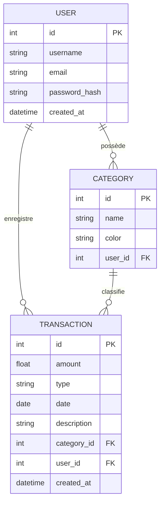
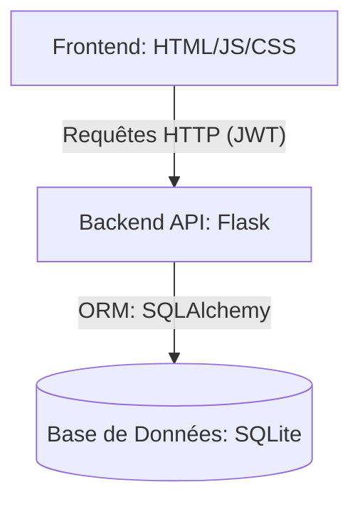

# Diagrammes Techniques

Voici les diagrammes représentant l'architecture et les données du projet.

## 1. Modèle de Données (ERD)

```mermaid
erDiagram
    USER ||--o{ TRANSACTION : "enregistre"
    USER ||--o{ CATEGORY : "possède"
    CATEGORY ||--o{ TRANSACTION : "classifie"

    USER {
        int id PK
        string username
        string email
        string password_hash
        datetime created_at
    }

    CATEGORY {
        int id PK
        string name
        string color
        int user_id FK
    }

    TRANSACTION {
        int id PK
        float amount
        string type
        date date
        string description
        int category_id FK
        int user_id FK
        datetime created_at
    }
```

## 2. Architecture Globale

```mermaid
graph TD
    Client[Frontend: HTML/JS/CSS] -- "Requêtes HTTP (JWT)" --> API[Backend API: Flask]
    API -- "ORM: SQLAlchemy" --> DB[(Base de Données: SQLite)]
```
